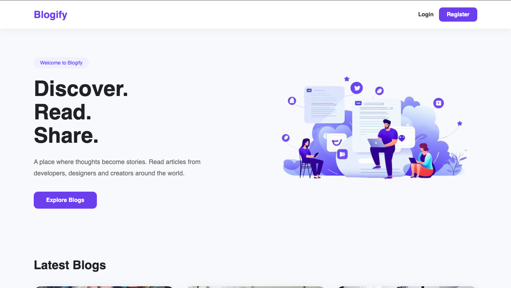
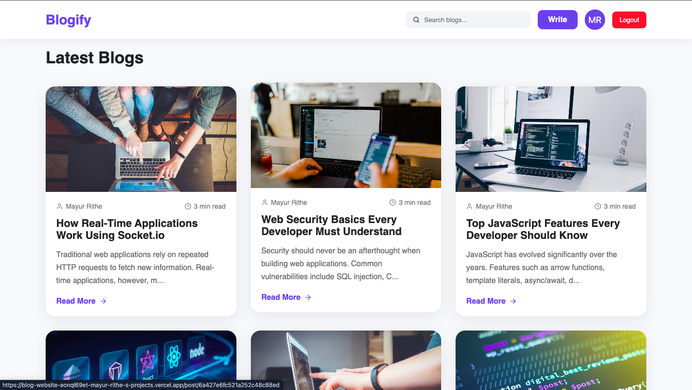
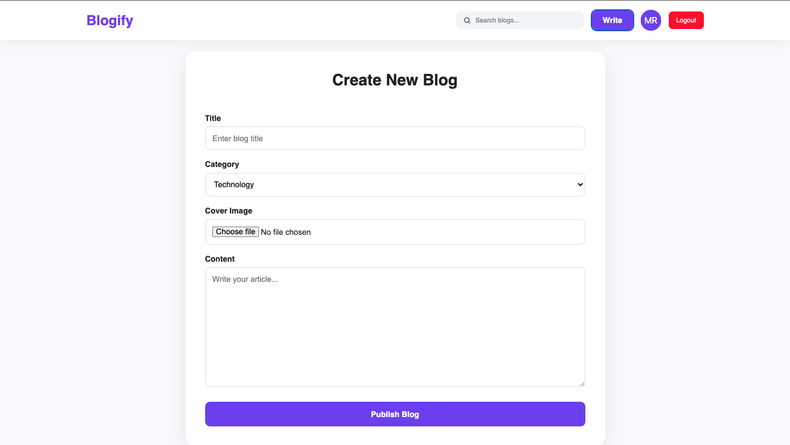
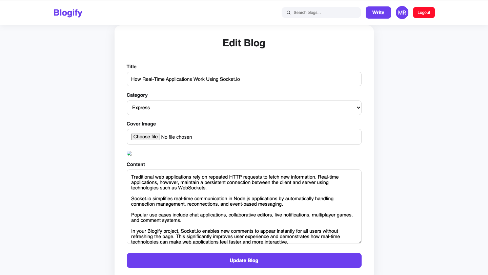
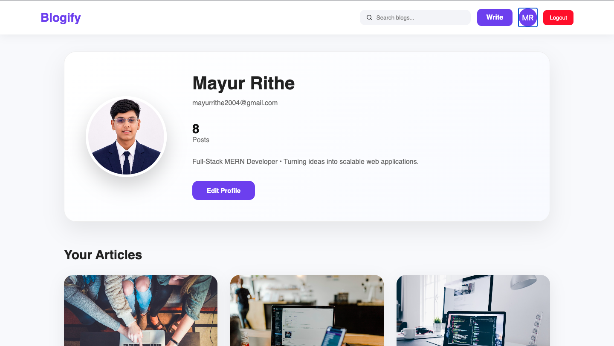
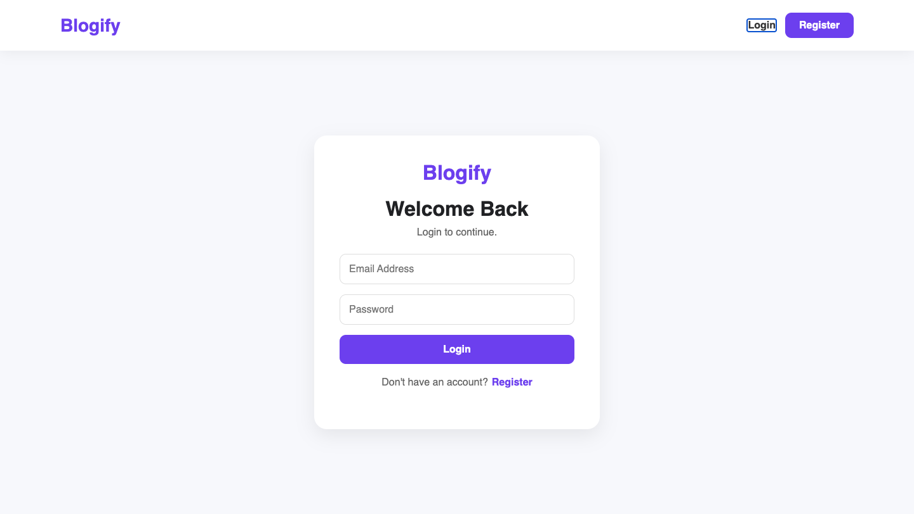
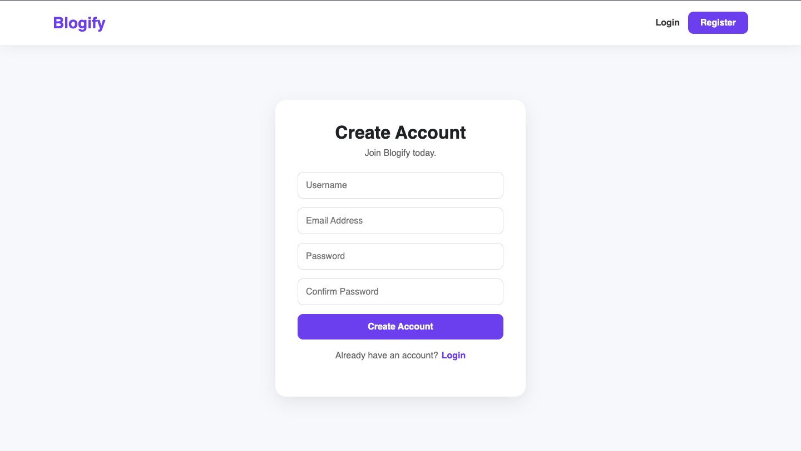

# ✨ Blogify - Modern MERN Blogging Platform

A modern full-stack blogging platform built using the **MERN Stack** that allows users to create, publish, discover, and discuss articles in a clean Medium-inspired interface.

Blogify provides secure authentication, Cloudinary-powered image uploads, real-time threaded comments, user profiles, search functionality, newsletter subscriptions, and a fully responsive user experience.

> Built with **React.js, Node.js, Express.js, MongoDB, Socket.IO, Cloudinary, and JWT Authentication**.

---

## 🌐 Live Demo

### 🚀 Frontend

https://blog-website-flame-six.vercel.app

### ⚙️ Backend API

https://blogify-backend-d2j2.onrender.com

---

## 📸 Screenshots

### Home

<p align="center">
  
</p>

### Blog Details

<p align="center">
  
</p>

### Create & Edit Blog

<p align="center">
  
  
</p>

### User Profile

<p align="center">
  
</p>

### Authentication

<p align="center">
  
  
</p>

---

## 🚀 Features

### 🔐 Authentication

- User Registration
- Secure Login
- JWT Authentication
- Protected Routes
- Logout
- Browser Session Authentication
- Automatic Logout when Browser Closes

### 📝 Blog Management

- Create Blog Posts
- Edit Existing Blogs
- Delete Blogs
- View All Blogs
- Read Full Articles
- Category Support
- Responsive Blog Cards
- Modern Article Layout

### ☁️ Cloudinary Integration

- Upload Blog Cover Images
- Upload Profile Pictures
- Secure Cloud Storage
- Optimized Image Delivery
- CDN Powered Images
- Automatic Image Compression
- No Local Image Storage

### 👤 User Profile

- Upload Profile Picture
- Edit Username
- Update Bio
- View Published Articles
- Post Counter
- Responsive Profile Layout

### 💬 Real-Time Comment System

Powered by **Socket.IO**

- Add Comments
- Nested Replies
- Delete Own Comments
- Real-time Updates
- Reddit-style Threaded Conversations

### 🔍 Smart Search

Search blogs by:

- Title
- Content
- Category
- Author

with instant client-side filtering.

### 📧 Newsletter

- Email Subscription
- Email Validation
- Success/Error Feedback

> **Note:** If newsletter subscriptions are currently handled client-side only (e.g. showing a success message without storing or sending emails), update this section and the API list below to reflect that accurately.

### ⚡ Skeleton Loaders

Beautiful loading placeholders for:

- Home Page
- Search Results
- Blog Details

### 🎨 Modern UI

- Medium-inspired Design
- Fully Responsive
- Mobile Friendly
- Smooth Hover Effects
- Clean Typography
- Modern Cards
- Elegant Animations

---

## 🛠 Tech Stack

### Frontend

- React.js
- Vite
- React Router DOM
- Axios
- React Icons
- Context API
- Socket.IO Client
- CSS3

### Backend

- Node.js
- Express.js
- MongoDB Atlas
- Mongoose
- JWT
- bcryptjs
- Cloudinary
- Multer
- Socket.IO
- CORS
- dotenv

### Deployment

| Service       | Platform      |
| ------------- | ------------- |
| Frontend      | Vercel        |
| Backend       | Render        |
| Database      | MongoDB Atlas |
| Image Storage | Cloudinary    |

---

## 📂 Project Structure

```text
blogify/
│
├── client/
│   ├── public/
│   ├── src/
│   │
│   ├── api/
│   ├── assets/
│   ├── components/
│   ├── context/
│   ├── loaders/
│   ├── pages/
│   ├── styles/
│   ├── socket.js
│   └── main.jsx
│
├── server/
│   ├── config/
│   ├── controllers/
│   ├── middleware/
│   ├── models/
│   ├── routes/
│   ├── sockets/
│   ├── utils/
│   ├── uploads/
│   └── server.js
│
└── README.md
```

---

## ⚙️ Installation

### Clone Repository

```bash
git clone https://github.com/Mayur-Rithe-14/blog-website.git
cd blog-website
```

### Backend Setup

```bash
cd server
npm install
```

Create a `.env` file:

```env
PORT=5000
MONGO_URI=YOUR_MONGODB_URI
JWT_SECRET=YOUR_SECRET_KEY
CLIENT_URL=http://localhost:5173
CLOUDINARY_CLOUD_NAME=YOUR_CLOUD_NAME
CLOUDINARY_API_KEY=YOUR_API_KEY
CLOUDINARY_API_SECRET=YOUR_API_SECRET
```

Run the backend:

```bash
npm run dev
```

### Frontend Setup

```bash
cd client
npm install
```

Create a `.env` file:

```env
VITE_API_URL=http://localhost:5000/api
VITE_SOCKET_URL=http://localhost:5000
```

Run the frontend:

```bash
npm run dev
```

---

## 📡 API Endpoints

### Authentication

```
POST    /api/auth/register
POST    /api/auth/login
```

### Posts

```
GET     /api/posts
GET     /api/posts/:id
POST    /api/posts
PUT     /api/posts/:id
DELETE  /api/posts/:id
```

### Comments

```
GET     /api/comments/:postId
POST    /api/comments/:postId
DELETE  /api/comments/:commentId
```

### Users

```
GET     /api/users/profile
PUT     /api/users/profile
```

### Newsletter

```
POST    /api/newsletter
```

> ⚠️ Only include this endpoint if newsletter subscriptions are actually persisted/sent on the backend. If it's currently client-side only, remove this section until implemented — this keeps the README accurate for recruiters and users.

---

## 💡 Project Highlights

- Full MERN Stack Application
- JWT Authentication
- Browser Session Login
- Cloudinary Image Uploads
- Real-time Comments using Socket.IO
- Nested Reply System
- Skeleton Loading UI
- Newsletter Subscription
- Search Functionality
- Responsive Design
- Protected Routes
- CRUD Operations
- RESTful API Architecture
- Modern Medium-inspired Interface

---

## 🚀 Future Improvements

- Like Posts
- Bookmark Blogs
- Follow Authors
- Dark Mode
- Trending Articles
- Tags
- Rich Text Editor
- Notifications
- AI Blog Recommendations
- AI Blog Summarization
- Reading Time Estimation
- Social Login (Google/GitHub)
- Email Verification
- Password Reset
- Admin Dashboard
- Analytics

---

## 📚 Learning Outcomes

This project demonstrates practical experience with:

- MERN Stack Development
- React Hooks
- Context API
- REST API Design
- MongoDB Relationships
- JWT Authentication
- Protected Routes
- CRUD Operations
- Socket.IO
- Cloudinary Integration
- Multer File Uploads
- Responsive UI Development
- Skeleton Loading Screens
- Client-side Search
- Deployment with Vercel & Render
- Git & GitHub Workflow

---

## 👨‍💻 Author

**Mayur Rithe**

- 📧 Email: mayurrithe2004@gmail.com
- 💻 GitHub: https://github.com/Mayur-Rithe-14
- 💼 LinkedIn: https://www.linkedin.com/in/mayur-rithe/
- 🌐 Portfolio: https://personal-portfolio-1-cqic.onrender.com

---

## ⭐ Support

If you found this project helpful, consider giving it a ⭐ Star on GitHub.

Your support motivates future improvements and helps others discover the project.

---

## 📄 License

This project is licensed under the MIT License.

Feel free to use it for learning, personal projects, and portfolio purposes.
